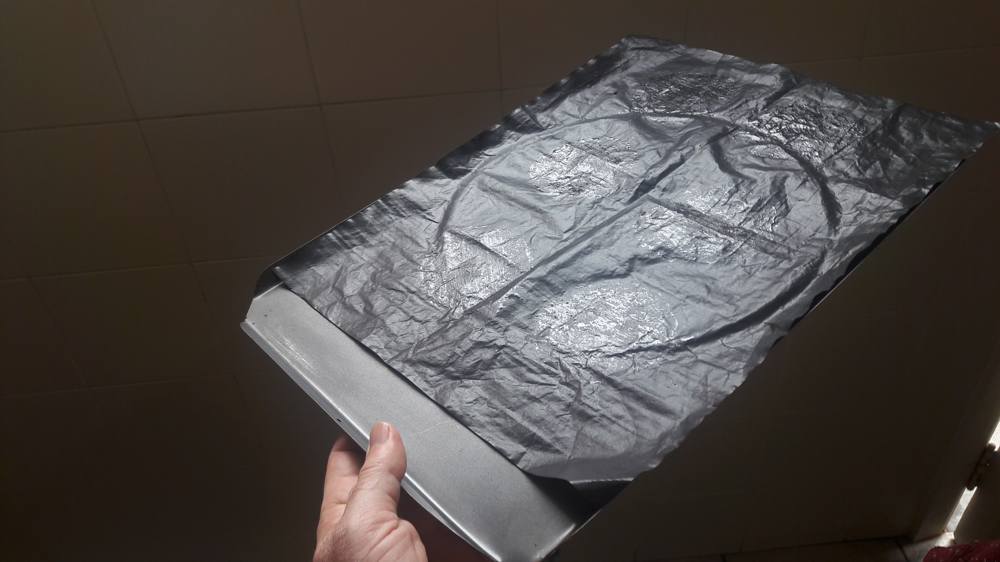

## Cookies perfeitos

Para 20 cookies:

### Ingredientes
* 225 g de manteiga
* 1 cubo de gelo
* 280 g de farinha de trigo
* 3/4 de colher de chá de bicarbonato de sódio (4 g)
* 2 colheres de chá cheias de sal (10 g)
* 140 g de açúcar branco
* 2 ovos grandes (100 g)
* 120 g de açúcar mascavo
* 2 colheres de chá de essência de baunilha (10 ml)
* 180 g de gotas de chocolate ou chocolate 70% picado

### Preparo

1. Em uma tigela misture a farinha, o açúcar mascavo, o sal, o chocolate e o bicarbonato. Reserve.
2. Derreta  manteiga em uma panela e mantenha no fogo até que fique de
   cor castanha.
3. Desligue o fogo, acrescente o cubo de gelo e deixe
   derreter. Deixe esfriar até que comece a ficar a opaca nas bordas da panela (28-25 C). 
4. Coloque na tigela da batedeira os ovos, o açúcar branco e a
   baunilha. Bata até virar uma creme claro e espesso (ca. 5 min e
   velocidade alta). Acrescente a manteiga derretida e bata até que
   esteja incorporada (cerca de mais 5 minutos). Deve ficar um creme
   uniforme e aerado.
5. Acrescente a mistura de ingredientes secos ao creme de manteiga e
   misture delicadamente com a colher. Misture apenas o suficiente
   para incorporar. Deve ficar um pouco mais coeso que uma farofa.
6. Cubra com filme plástico e leve à geladeira por no mínimo 8 h e
   máximo de três dias.
7. Para assar, preaqueça o forno a 175 C. Para forno elétrico deixe
   as resistências superior e inferior no máximo.
8. Retire a massa da geladeira e faça uma bola de 5-6 cm de diâmetro com uma colher de
   sorvete, tentando não amassar. Com a mão quebre a bola ao meio ou a
   esfarele e reconstitua deixando-a o menos compactada possível. Deve
   ficar com a superfície bem irregular (ver foto).
9. Coloque as bolas de massa em uma forma antiaderente, a uma
   distância equivalente ao seu diâmetro.
10. Asse apenas o suficiente para corar e formar um crosta fina. 
	Você vai ter que descobrir este ponto para seu forno, que deve estar
    entre 5 e 15 minutos. Vire a forma na metade do tempo de assar.
11. Deixe esfriar na forma por 5 minutos e então transfira para uma
    grade e deixe descansar por 30 minutos. Guarde em recipiente hermético.

### Macetes

* Meu ideal de perfeição para cookies é que seja alto, com
  superfície irregular e com interior macio, úmido e
  caramelado. Pesquisei até encontrar a receita que mais se aproximava
  disto, que encontrei no site *Serious
  Eats* [^1]. Lá está a explicação de cada passo da receita e também
  como variar para obter cookies com outras características. A minha
  receita têm umas poucas modificações.
* Para conseguir um cookie alto com interior macio é preciso que o
  exterior asse e forme uma casca rápido. Depois de experimentar
  bastante com meu forno elétrico cheguei ao tempo de 6 minutos a 175 C, com 
  as duas resistências no máximo, e na grade do meio. A vantagem do
  forno elétrico é que a resistência superior acelera a formação da
  casca de cima.
* Uma forma para cookies também ajuda a ter bons resultados. Ela é
  fina e aquece rápido. E em geral são antiaderentes. Ainda assim uso
  uma folha antiaderente reutilizável (compra-se em lojas de
  confeitaria).
* O sal acentua o sabor do cookie. Para aumentar este efeito polvilhe
  um pouco de sal moído fino (ou *Maldon salt*) sobre os cookies logo
  que tirá-los do forno.
  

  
[^1]: The Best Chocolate Chip Cookies Recipe. The Food Lab - Unraveling the mysteries of home cooking through science. By J. Kenji López-Alt http://www.seriouseats.com/recipes/2013/12/the-food-lab-best-chocolate-chip-cookie-recipe.html
